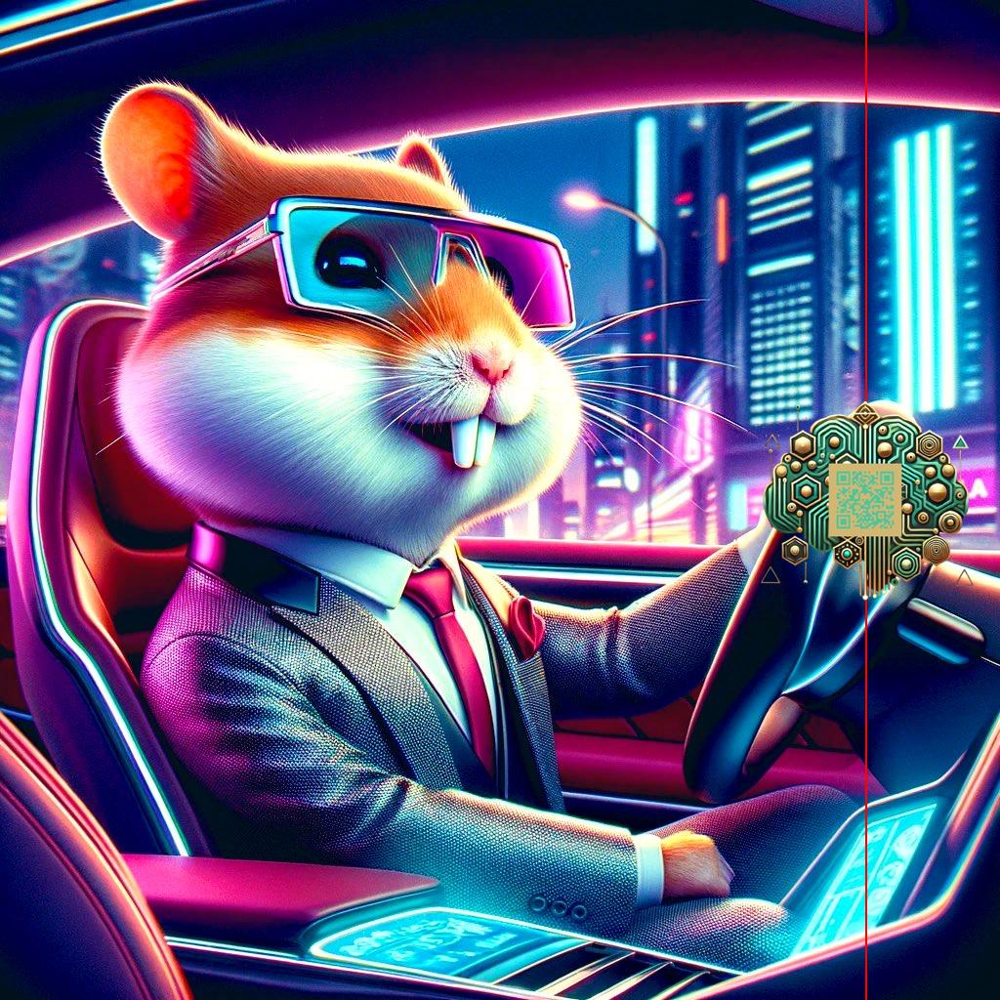

# 🚀🤖 **MariaAi Authenticator**: Innovation and Security in the Cryptocurrency Ecosystem

**MariaAi** is revolutionizing the integration of artificial intelligence and blockchain in the cryptocurrency world. Introducing **CyaNet Authenticator**, our innovative tool to ensure authenticity, security, and transparency of official network images. This marks the foundation of a decentralized ecosystem that leverages cutting-edge AI and blockchain technologies.

---

## 🔍 **Overview**

**MariaAi Authenticator** is a pioneering project in the **ICP Network**, providing secure and reliable image authentication with custom QR Codes. It ensures:

- **Authenticity**: Validates official images with unique, immutable QR signatures.
- **Transparency**: Facilitates user-friendly verification within decentralized systems.

The core functionalities are powered by **CyaNet AI Integration MVP**, with plans to extend its capabilities into:

✅ **Cryptocurrency Chatbots**  
✅ **Decentralized Authentication Systems**  

---

## 💡 **Technological Highlights**

1. **Blockchain Integration**: Ensures decentralized, immutable data for secure validation.  
2. **AI-Powered Efficiency**: Automates QR Code generation and authentication with high scalability.

This combination of **AI** and **blockchain** represents a significant leap towards a more secure and reliable cryptocurrency ecosystem.

---

## 📅 **Roadmap**

Follow our journey as we integrate new features into **MariaAi Authenticator**, expanding its ecosystem and utility for developers and users.

---

## 🌐 **OpenChat Integration**

📢 Join the MariaAi community on **OpenChat**! Collaborate, share ideas, and stay updated with our latest developments.

---

## 🛠️ **How It Works**

1. Authenticate official images with secure QR Codes.
2. Validate transactions via **ICP Network** integration.
3. Provide decentralized security for AI-powered ecosystems.

---

## 🌟 **Key Features**

### **Authentication**
- Protect official images with unique, AI-generated QR Codes.

### **Token Ecosystem**
- Supports MariaAi tokens: **$MAIAI**, **$CyaNet**, and **$AIGT**.

### **Developer Tools**
- Seamless integration for developers in the ICP Network.

---

## 💻 **Official Wallets**

- **$MAIAI**: `sfqo2-lj4k2-7gg6k-uugaq-doz4b-xogar-uoam4-3yhci-uzfkf-nu6y4-cae`
- **$CyaNet**: `ex7qx-diyis-34dwm-uezvl-ojdcl-aftew-lbhp2-f7r6z-jnzug-qlh7x-cae`
- **$AIGT**: `ex7qx-diyis-34dwm-uezvl-ojdcl-aftew-lbhp2-f7r6z-jnzug-qlh7x-cae`

---

## 🔗 **Official Links**

- 🌐 [**Website ($MAIAI)**](https://mariaai.fun)  
- 💬 [**Telegram**](https://t.me/mariaAi18y)  
- 🐦 [**Twitter (X)**](https://x.com/MariaAi18y)  
- 🤖 [**Launch.bob.fun (BOB)**](https://launch.bob.fun)  
- 💻 [**ICPSwap**](https://app.icpswap.com/swap)  
- 🧪 [**NNS (IC0 APP)**](https://nns.ic0.app)  
- 👨🏻‍💻 [**ICP Tokens by Market Cap**](https://icptokens.net)

---

## 🎨 **Logos**

### **Developer Logo**

### **Token Logos**
- **$MAIAI**  

- **$AIGT**  

- **$CyaNet**  

---

## 🏆 **Conclusion**

The **CyaNet Authenticator** is a stepping stone toward MariaAi's vision of a decentralized future. By combining blockchain and AI, we aim to set new standards in security and innovation.

🚀 **Join us in shaping the future of decentralized AI and cryptocurrency!**

**Developed with 💡 by MariaAI**  
🌐 [mariaai.fun](https://mariaai.fun) | 💬 [Telegram](https://t.me/mariaAi18y) | 🐦 [Twitter](https://x.com/MariaAi18y) | 👨🏻‍💻 [Internet Computer](https://internetcomputer.org)
